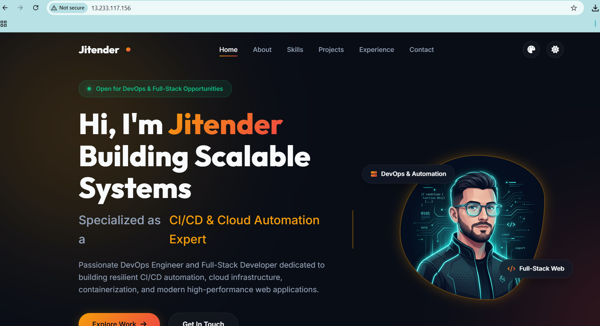
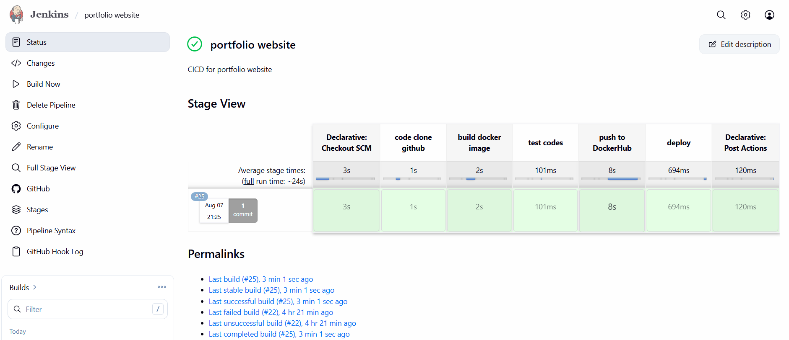
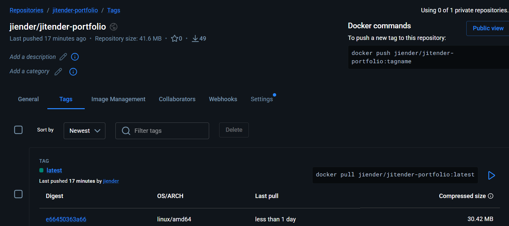

# 🚀 Portfolio Website with Automated CI/CD Pipeline

<p align="center">
  <h3 align="center">Personal Portfolio Website with Jenkins, Docker & AWS EC2</h3>

  <p align="center">
    A responsive portfolio website automatically built, containerized, and deployed to AWS EC2 using an automated Jenkins CI/CD pipeline.
  </p>

  <p align="center">
    
    
    
    
    
  </p>
</p>

---

# 📖 Project Overview

This project is a modern, responsive portfolio website developed to showcase my skills, projects, and experience. Beyond the website itself, the project demonstrates a complete DevOps workflow by implementing an automated CI/CD pipeline.

Whenever new code is pushed to GitHub, Jenkins automatically clones the repository, builds a Docker image, pushes it to Docker Hub, deploys the latest container to an AWS EC2 instance, and sends email notifications about the pipeline status. This ensures fast, reliable, and repeatable deployments with minimal manual intervention.

---

# 🌍 Live Demo

### 🔗 Live Website

http://13.233.117.156

### 📂 GitHub Repository

https://github.com/jitender81/portfolio_website

---

# 📸 Project Showcase

## 🌐 Live Portfolio Website

<p align="center">

</p>

---

## ⚙️ Jenkins CI/CD Pipeline

<p align="center">

</p>

The Jenkins pipeline automatically performs the following steps:

- Clone source code from GitHub
- Build Docker image
- Push image to Docker Hub
- Deploy latest container on AWS EC2
- Send email notification after pipeline execution

---

## 🐳 Docker Hub Repository

<p align="center">

</p>

Every successful build automatically publishes the latest Docker image to Docker Hub, enabling consistent and version-controlled deployments.

---

# ✨ Features

- Modern Responsive Portfolio Website
- Clean User Interface
- Mobile Friendly Design
- Projects Showcase
- About Me Section
- Contact Section
- Dockerized Application
- Automated CI/CD Pipeline
- Jenkins Integration
- Docker Hub Integration
- AWS EC2 Deployment
- Email Notifications
- Zero Manual Deployment

---

# 🛠 Tech Stack

| Category | Technologies |
|-----------|--------------|
| Frontend | HTML, CSS, JavaScript |
| CI/CD | Jenkins |
| Containerization | Docker |
| Container Registry | Docker Hub |
| Cloud Platform | AWS EC2 |
| Version Control | Git & GitHub |
| Operating System | Linux |
| Scripting | Shell |

---

# 🏗 CI/CD Architecture

```text
                    Developer
                        │
                        ▼
                 Push Code to GitHub
                        │
                        ▼
               Jenkins Pipeline Trigger
                        │
        ┌───────────────┼────────────────┐
        ▼               ▼                ▼
   Clone Code      Build Docker      Verify Build
                        │
                        ▼
              Push Image to Docker Hub
                        │
                        ▼
             Deploy Container on AWS EC2
                        │
                        ▼
             Email Notification (Success/Failure)
                        │
                        ▼
                  Live Portfolio Website
```

---

# ⚙️ Jenkins Pipeline Workflow

1. Push latest code to GitHub.
2. Jenkins automatically detects repository changes.
3. Source code is cloned.
4. Docker image is built.
5. Docker image is pushed to Docker Hub.
6. Existing container is replaced with the latest version.
7. Application is deployed on AWS EC2.
8. Email notification is sent after pipeline execution.

---

# 📂 Project Structure

```text
portfolio_website/
│
├── images/
│   ├── portfolio-home.png
│   ├── jenkins-pipeline.png
│   └── dockerhub.png
│
├── css/
├── js/
├── assets/
├── Dockerfile
├── docker-compose.yml
├── Jenkinsfile
├── index.html
└── README.md
```

---

# 🚀 Run the Project Locally

## Clone Repository

```bash
git clone https://github.com/jitender81/portfolio_website.git
```

## Navigate to Project

```bash
cd portfolio_website
```

## Build Docker Image

```bash
docker build -t portfolio .
```

## Run Docker Container

```bash
docker run -d -p 80:80 portfolio
```

Open your browser and visit:

```
http://localhost
```

---

# 📦 Useful Docker Commands

```bash
docker build -t portfolio .

docker images

docker run -d -p 80:80 portfolio

docker ps

docker stop <container-id>

docker rm <container-id>
```

---

# 📊 DevOps Highlights

- Automated Jenkins CI/CD Pipeline
- Docker Image Creation
- Docker Hub Image Publishing
- Automated AWS EC2 Deployment
- Containerized Application
- Git Version Control
- Email Notifications
- Infrastructure Ready for Kubernetes

---

# 🚀 Future Enhancements

- Kubernetes Deployment
- Terraform Infrastructure as Code
- Nginx Reverse Proxy
- HTTPS with SSL Certificate
- Custom Domain
- Prometheus Monitoring
- Grafana Dashboard
- GitHub Actions CI/CD

---

# 👨‍💻 Author

## Jitender Mahlawat

- **GitHub:** https://github.com/jitender81
- **LinkedIn:** https://www.linkedin.com/in/jitender-mahlawat
- **Email:** jitendermahlawat696@gmail.com

---

## ⭐ Support

If you found this project useful or interesting, please consider giving it a **⭐ Star** on GitHub.

It motivates me to continue building DevOps, Cloud, and Automation projects.

---